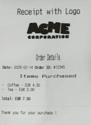
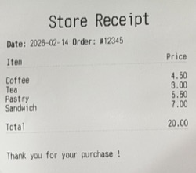
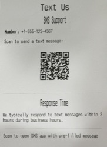

# escpos

A Go CLI tool that converts markdown files to ESC/POS format and prints them on POS-80 thermal printers via macOS CUPS.

[](https://amzn.to/3OjyAHc)

> **Tested with:** Vretti M817 80mm Thermal Receipt Printer (USB connection via macOS CUPS)

## Features

- **Markdown to thermal printer** -- Parse markdown and generate ESC/POS byte sequences
- **Text formatting** -- Headings (3 sizes), bold, italic (as underline), paragraphs
- **Lists** -- Unordered, ordered, and task lists with nesting
- **Tables** -- Receipt format (2 columns), bordered (3 columns), vertical key-value (4+ columns)
- **Images** -- PNG, JPG, BMP converted to 1-bit bitmaps with configurable threshold
- **Barcodes** -- QR codes, PDF417, and DataMatrix via fenced code blocks

## Examples

| With Image | Store Receipt | SMS QR Code |
|:----------:|:-------------:|:-----------:|
| [](docs/images/with_image.jpg) | [](docs/images/receipt.jpg) | [](docs/images/qr-sms.jpg) |
| Print contains a BMP image | Print contains a two-column receipt layout | Print contains a QR code with an SMS link |
| [with_image.md](testdata/with_image.md) | [receipt.md](testdata/receipt.md) | [qr_sms.md](testdata/qr_sms.md) |

## Installation

### Via Go Install

```bash
go install github.com/messeb/escpos-cli/cmd/escpos@latest
```

### From Source

```bash
git clone https://github.com/messeb/escpos-cli.git
cd escpos-cli
make build
```

## Build

```bash
# Build to ./dist/escpos
make build

# Or manually
go build -o ./dist/escpos cmd/escpos/main.go
```

## Usage

```bash
escpos [flags] [file.md]
```

### Examples

```bash
escpos receipt.md                                    # default printer
escpos -printer Printer_POS_80 -file receipt.md      # explicit printer
escpos -printer MyPrinter receipt.md -threshold 60   # darker images
```

### Flags

| Flag | Default | Description |
|------|---------|-------------|
| `-printer` | `Printer_POS_80` | CUPS printer name |
| `-file` | | Markdown file to print |
| `-threshold` | `75` | Gray threshold for images (0-100, higher = more black) |

The first positional argument is treated as the markdown file if `-file` is not specified.

## Markdown Format

The tool supports a subset of markdown optimized for 80mm thermal paper (~40-46 character width).

### Text

```markdown
# Heading 1      --> double-size bold centered
## Heading 2     --> double-height bold centered
### Heading 3    --> double-width bold centered
**bold text**    --> ESC/POS bold
*italic text*    --> rendered as underline
```

### Lists

```markdown
- Unordered item
  - Nested item
1. Ordered item
- [x] Completed task
- [ ] Pending task
```

### Tables

```markdown
| Item   | Price |
|--------|------:|
| Coffee |  4.50 |
| Tea    |  3.00 |
```

- 2-column tables: receipt format (no borders, right-aligned values)
- 3-column tables: ASCII bordered
- 4+ columns: vertical key-value layout

### Images

```markdown

```

Images are converted to 1-bit bitmaps, scaled to max 384px width. Relative paths resolve from the markdown file location. Use the `-threshold` flag to control darkness.

### Barcodes

The tool supports multiple barcode formats through fenced code blocks. The barcode type is specified as the language identifier after the opening backticks.

#### QR Code (2D)

QR codes are rendered as bitmaps. Best for URLs, contact info, or any data that needs to be scanned by smartphones.

**Basic URL:**
````markdown
```qr
https://example.com/product/12345
```
````

**WiFi Network:**
````markdown
```qr
WIFI:T:WPA;S:MyNetworkName;P:MyPassword123;;
```
````
Format: `WIFI:T:[WPA|WEP|nopass];S:[network name];P:[password];;`

**vCard (Contact Card):**
````markdown
```qr
BEGIN:VCARD
VERSION:3.0
FN:John Doe
ORG:Acme Corp
TEL:+1-555-123-4567
EMAIL:john.doe@example.com
URL:https://example.com
END:VCARD
```
````

**Email:**
````markdown
```qr
mailto:support@example.com?subject=Product%20Inquiry&body=Hello
```
````

**Phone Call:**
````markdown
```qr
tel:+1-555-123-4567
```
````

**SMS:**
````markdown
```qr
sms:+1-555-123-4567?body=Hello%20from%20thermal%20printer
```
````

**Payment (Bitcoin):**
````markdown
```qr
bitcoin:1A1zP1eP5QGefi2DMPTfTL5SLmv7DivfNa?amount=0.001
```
````

**Payment (Generic URL):**
````markdown
```qr
https://pay.example.com/invoice/12345?amount=25.00
```
````

**Event (iCalendar):**
````markdown
```qr
BEGIN:VEVENT
SUMMARY:Team Meeting
DTSTART:20260215T140000Z
DTEND:20260215T150000Z
LOCATION:Conference Room A
END:VEVENT
```
````

**Use cases:** URLs, Wi-Fi credentials, contact cards (vCard), payment links, calendar events
**Capacity:** Up to ~3KB of data
**Scanner:** Any smartphone camera or QR reader

#### EAN-13 (1D)

Standard retail product barcode. Data must be exactly 12 or 13 digits. If 12 digits are provided, the check digit is calculated automatically by the printer.

````markdown
```ean13
1234567890128
```
````

**Use cases:** Retail products, inventory management, point-of-sale
**Format:** 12-13 numeric digits only
**Scanner:** Laser barcode scanners, smartphone apps

#### PDF417 (2D)

High-capacity stacked barcode. Can encode large amounts of text and binary data. Printer support may vary.

````markdown
```pdf417
PRODUCT:ABC123;BATCH:2024-01;LOT:XYZ789
```
````

**Use cases:** Shipping labels, driver's licenses, inventory tracking
**Capacity:** Up to ~1.8KB of data
**Scanner:** 2D barcode scanners (not smartphone cameras)

#### DataMatrix (2D)

Compact 2D barcode for small items. Good for encoding serial numbers and product codes. Printer support may vary.

````markdown
```datamatrix
SN:ABC123456789
```
````

**Use cases:** Small product marking, electronics, PCB identification
**Capacity:** Up to ~2KB of data
**Scanner:** 2D barcode scanners, some smartphone apps

#### Barcode Tips

- **QR codes** work with any smartphone - best for customer-facing applications
- **EAN-13** requires numeric-only data (12-13 digits)
- **PDF417** and **DataMatrix** require compatible scanners and printer support
- Test on your specific printer - not all ESC/POS printers support all 2D formats
- Keep data concise for better scanning reliability
- Print test pages before production use

## Project Structure

```
printer/
├── cmd/
│   └── escpos/            # CLI entry point
│       └── main.go
├── internal/
│   ├── escpos/            # ESC/POS protocol primitives
│   │   ├── commands.go    # Command constants (Init, Bold, Cut, etc.)
│   │   ├── printer.go     # Print job management (lpr/CUPS)
│   │   ├── image.go       # Image-to-bitmap conversion
│   │   └── barcode.go     # QR, PDF417, DataMatrix generation
│   └── markdown/          # Markdown rendering engine
│       ├── builder.go     # Entry point (BuildMarkdownPrint)
│       ├── renderer.go    # ESC/POS AST walker
│       ├── table.go       # Table layout algorithms
│       └── extension.go   # Goldmark barcode extension
├── testdata/              # Sample markdown files
├── go.mod
└── README.md
```

## Printer Setup

1. Connect your POS-80 thermal printer via USB
2. Open **System Preferences > Printers & Scanners**
3. Add the printer and note its name
4. Pass the name with `-printer` (or use the default `Printer_POS_80`)

## Dependencies

| Package | Purpose |
|---------|---------|
| [goldmark](https://github.com/yuin/goldmark) | Markdown parsing (CommonMark + GFM) |
| [go-qrcode](https://github.com/skip2/go-qrcode) | QR code generation |
| [golang.org/x/image](https://pkg.go.dev/golang.org/x/image) | BMP image format support |
